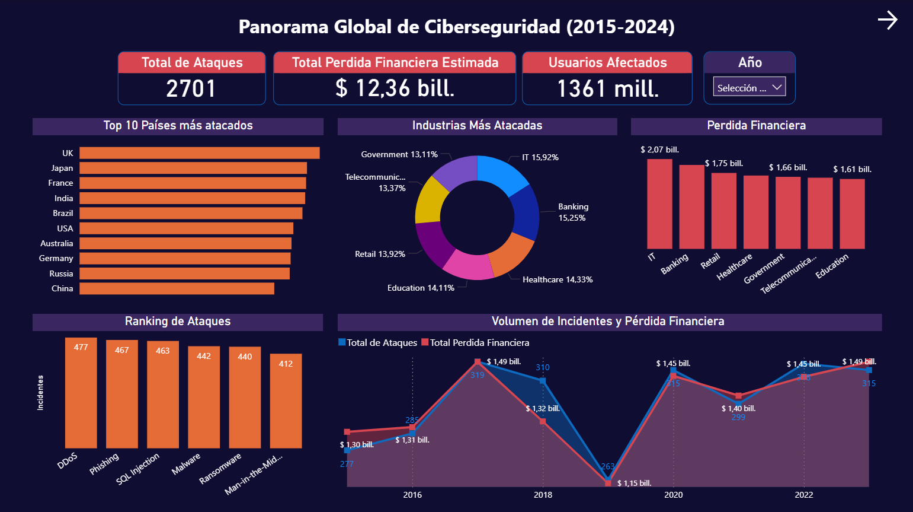
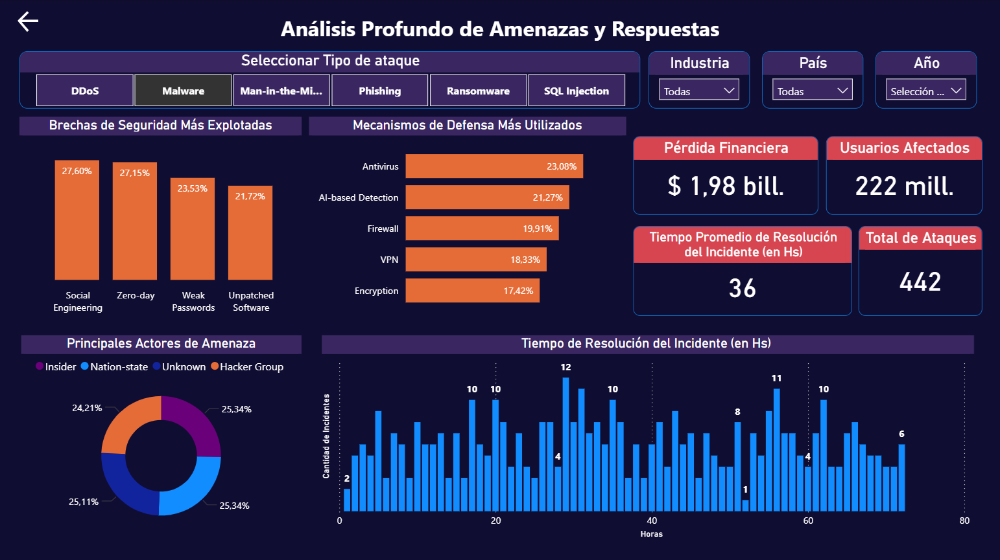

# Reporte de Amenazas Globales a la Ciberseguridad de 2015 a 2024
Para este análisis, utilicé un dataset sintético de Kaggle ("[Global Cybersecurity Threats](https://www.kaggle.com/datasets/atharvasoundankar/global-cybersecurity-threats-2015-2024)") diseñado específicamente para fines educativos y de práctica.

El reporte tiene dos vistas principales:

## Página 1 - Panorama Global: 
Una vista ejecutiva que responde al "qué, dónde y cuánto" del impacto de los ciberataques, mostrando los países más afectados, las industrias más vulnerables y las tendencias a lo largo del tiempo.

## Página 2 - Análisis de Amenazas 
Un desglose profundo donde se puede filtrar por un tipo de ataque específico (como Malware o Phishing) para analizar en detalle las vulnerabilidades que explota, las defensas más comunes y los actores de amenaza detrás de ellos.

